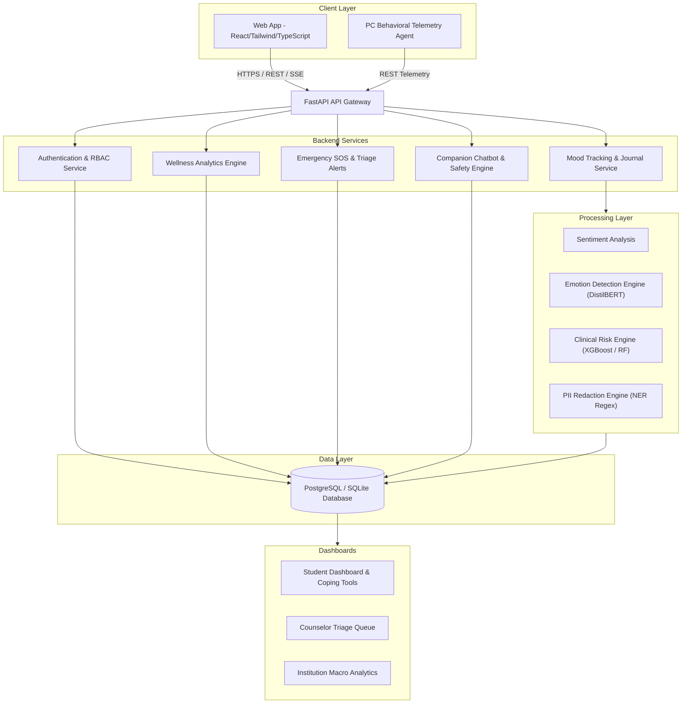
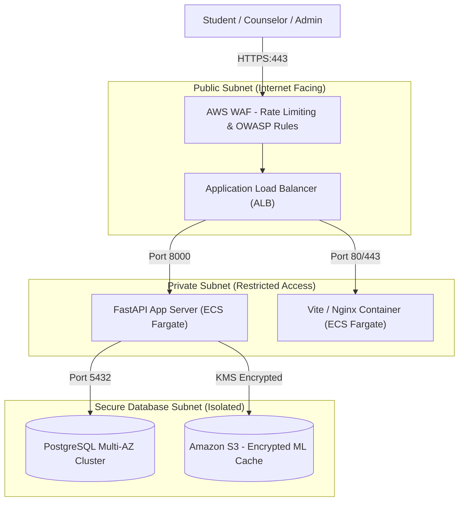
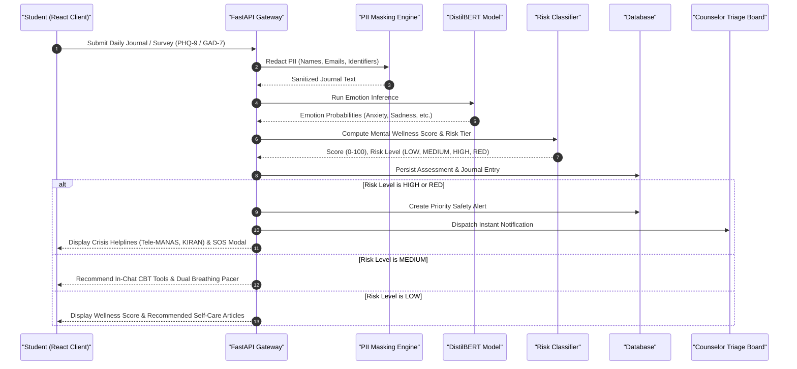
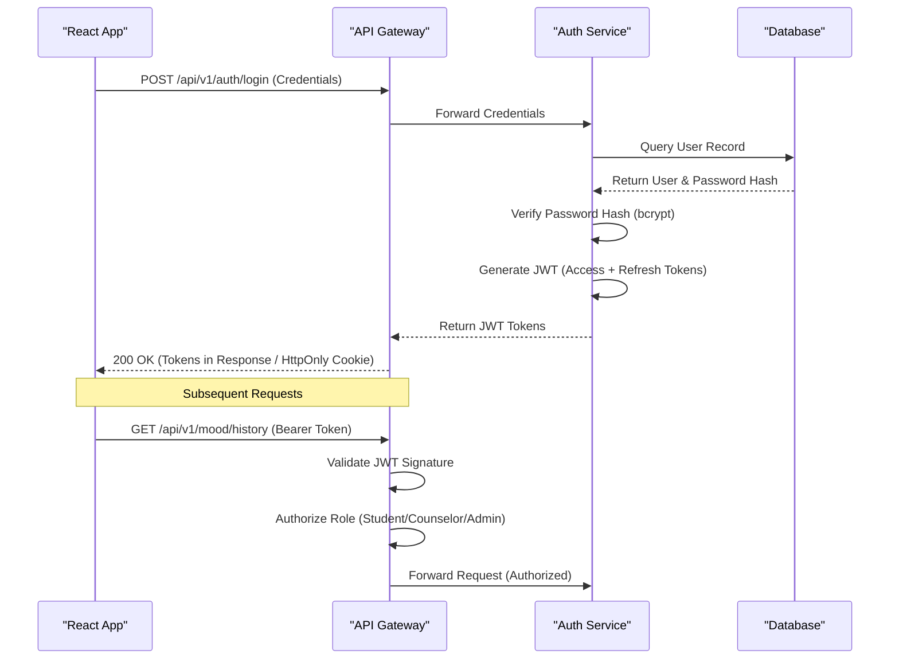
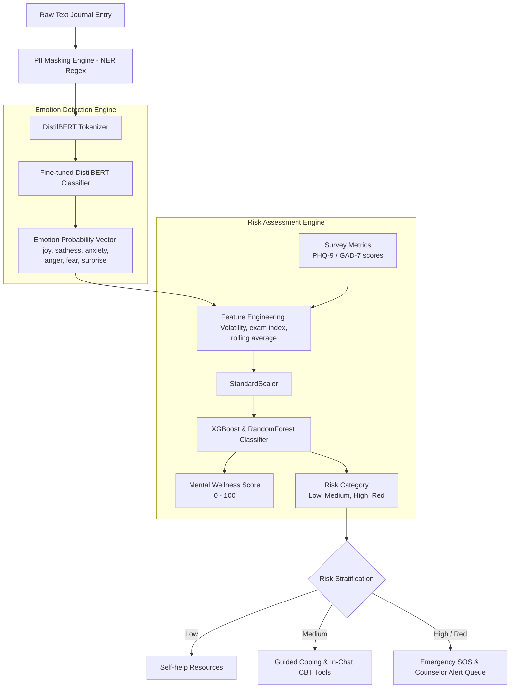

# MindGuardAI: Student Wellness and Mental Health Platform

<p align="center">
  
  
  
  
  
  
  
  
  
</p>

---

## Synopsis

**MindGuardAI** is an academic mental health and psychological support platform that transitions student care from a reactive model to a proactive, preventive system. By integrating student self-reflections (text/voice journals), standardized clinical surveys (PHQ-9 and GAD-7), real-time behavioral digital biomarkers, in-chat cognitive behavioral therapy (CBT) micro-modules, and an NLP processing pipeline, the system automatically stratifies risk to deliver tailored self-help resources, emergency SOS assistance, or direct counselor triage queue escalation.

### Table of Contents

- [1. Project Overview](#1-project-overview)
- [2. Core Features](#2-core-features)
- [3. System Architecture](#3-system-architecture)
  - [3.1 Component Architecture Diagram](#31-component-architecture-diagram)
  - [3.2 Network Isolation and Subnet Security Diagram](#32-network-isolation-and-subnet-security-diagram)
- [4. Platform Workflow (How it Works)](#4-platform-workflow-how-it-works)
  - [4.1 Daily Check-In and Evaluation Lifecycle](#41-daily-check-in-and-evaluation-lifecycle)
  - [4.2 Authentication Flow](#42-authentication-flow)
- [5. Quick Start and Execution (How to Run)](#5-quick-start-and-execution-how-to-run)
  - [5.1 Environment Configuration](#51-environment-configuration)
  - [Option A: Containerized Execution (Docker Compose)](#option-a-containerized-execution-docker-compose)
  - [Option B: Manual Local Setup (Host Machine)](#option-b-manual-local-setup-host-machine)
  - [5.3 Default Seeding Credentials](#53-default-seeding-credentials)
  - [5.4 Running Automated Verification Suites](#54-running-automated-verification-suites)
- [6. Machine Learning Pipeline (In Depth)](#6-machine-learning-pipeline-in-depth)
  - [6.1 Data Preprocessing & PII Masking](#61-data-preprocessing--pii-masking)
  - [6.2 Model Versioning & MLflow](#62-model-versioning--mlflow)
- [7. Deployment & CI/CD Guidelines](#7-deployment--cicd-guidelines)
  - [7.1 AWS Production Topology](#71-aws-production-topology)
  - [7.2 CI/CD Pipeline Workflow (GitHub Actions)](#72-cicd-pipeline-workflow-github-actions)
- [8. Project Structure](#8-project-structure)
- [9. Documentation Index](#9-documentation-index)
- [10. License](#10-license)

---

## 1. Project Overview

**MindGuardAI** is a proactive, digital mental health and psychological support platform designed specifically for academic institutions. Unlike traditional mental health resources that are reactive (responding only after a student reaches crisis), MindGuardAI establishes a secure, continuous, and intelligent check-in ecosystem.

By combining self-guided tracking tools, standardized clinical surveys, non-invasive behavioral telemetry, and advanced asynchronous NLP emotion-detection pipelines, MindGuardAI facilitates early distress detection and provides actionable, real-time insights for both students and university counseling staff.

---

## 2. Core Features

- **Dual-Input Student Journals:** Secure, daily self-reflection submissions using both structured text or simulated voice transcripts.
- **Standardized Clinical Diagnostics:** Interactive, periodic implementation of validated questionnaires:
  - PHQ-9 (Patient Health Questionnaire for depression severity assessment)
  - GAD-7 (Generalized Anxiety Disorder questionnaire)
- **Interactive CBT Micro-Modules (In-Chat):**
  - **Dual Breathing Pacer:** Box Breathing (4-4-4-4) for autonomic stability and 4-7-8 Relaxing Breath for deep parasympathetic relaxation with animated countdown ring.
  - **5-4-3-2-1 Sensory Grounding Tool:** Multi-step sensory checklist (Sight, Touch, Hearing, Smell, Taste/Anchor) with tactile prompts and direct report-to-chat sharing.
  - **Cognitive Thought Distortion Reframer:** Interactive tool identifying 5 cognitive distortions (*Catastrophizing*, *All-or-Nothing*, *Mind Reading*, *Emotional Reasoning*, *Overgeneralization*) with Automatic Negative Thought (ANT) restructuring and reflection sharing.
- **Emergency Crisis SOS Gateway:**
  - One-tap direct counselor alert dispatching to the university triage queue with `CRITICAL PRIORITY`.
  - Direct 24/7 tele-health crisis helplines: **Tele-MANAS** (`14416`), **KIRAN** (`1800-599-0019`), and **Campus Health Clinic** (`+91 22 4235 5555`).
  - Omnipresent access via top navigation bar and in-chat coping toolbar.
- **Non-Invasive Behavioral PC Agent (`mindguard_pc_agent.py`):**
  - Local, privacy-first background telemetry tracking active application categories, total screen time, late-night circadian disruption, and continuous screen usage.
  - Real-time emergency detection for urgent distress search queries with immediate counselor safety event creation.
- **Multi-Engine AI/ML Pipeline:**
  - Fine-tuned DistilBERT (HuggingFace Transformers) mapping journal text to emotional states.
  - Custom Random Forest and XGBoost classifier mapping emotional vectors and clinical metrics to a quantified Mental Wellness Score (0-100) and risk tier.
  - Named Entity Recognition (NER) pipeline for real-time PII (Personally Identifiable Information) masking.
- **The Decision Diamond Router:** Automated routing based on risk stratification:
  - **Low Risk:** Personalized self-help resources, mindfulness articles, and content-based recommendations.
  - **Medium Risk:** Interactive coping exercises, dual breathing guides, and cognitive behavioral therapy (CBT) micro-modules.
  - **High Risk:** Direct counselor escalation, real-time notification alerts, and placement in the triage queue.
- **Role-Based Portals:**
  - **Student Portal:** Daily logging, history analytics graphs, interactive CBT exercises, and personalized recommendations.
  - **Counselor Portal:** Alert management board, patient risk logs, triage queue management, and contact outreach logging.
  - **Institution Portal:** Aggregated, fully anonymized wellness analytics to identify macro-trends without violating student privacy.

---

## 3. System Architecture

MindGuardAI utilizes a decoupled, N-tier micro-monolith architectural pattern configured for complete environment parity and backend-to-frontend safety.

### 3.1 Component Architecture Diagram

The system partitions user interaction from compute-heavy machine learning calculations. This ensures synchronous operations (like auth or log loads) remain non-blocking.



### 3.2 Network Isolation and Subnet Security Diagram

To maintain strict compliance and prevent data leaks, MindGuardAI segregates communication into a dual-network configuration:



---

## 4. Platform Workflow (How it Works)

### 4.1 Daily Check-In and Evaluation Lifecycle



### 4.2 Authentication Flow

Authentication is managed via JSON Web Tokens (JWT) using short-lived Access Tokens (15-30 minutes) and HttpOnly secure Refresh Cookies with complete Role-Based Access Control (RBAC).



---

## 5. Quick Start and Execution (How to Run)

MindGuardAI supports running either fully containerized via Docker or through a standard local host environment.

### 5.1 Environment Configuration
Before executing any setup, copy the root environment variables file:

```bash
# Copy root env template
cp .env.example .env
```

Ensure your root `.env` matches the following parameters:

```ini
PROJECT_NAME="MindGuardAI API"
VERSION="1.0.0"
ENVIRONMENT="development"

# Database Configuration (PostgreSQL / SQLite)
POSTGRES_USER=postgres
POSTGRES_PASSWORD=mindguard_secure_pass
POSTGRES_DB=mindguard
POSTGRES_SERVER=db
POSTGRES_PORT=5432
DATABASE_URL=sqlite+aiosqlite:///./mindguard.db

# Security / JWT
SECRET_KEY=very_secret_development_key_change_in_prod
ALGORITHM=HS256
ACCESS_TOKEN_EXPIRE_MINUTES=30
REFRESH_TOKEN_EXPIRE_DAYS=7

# Frontend Configuration
VITE_API_BASE_URL=http://localhost:8000/api/v1
```

---

### Option A: Containerized Execution (Docker Compose)

This is the fastest method to stand up the entire platform. It configures and links PostgreSQL, the FastAPI API, the ML Worker, and the React frontend.

> [!IMPORTANT]
> Make sure Docker and Docker Compose are installed and running on your system.

#### 1. Build and Run the Stack
Run the following command from the root directory:
```bash
docker-compose up --build
```

This starts:
- **Frontend SPA:** accessible at `http://localhost:5173`
- **FastAPI backend API:** accessible at `http://localhost:8000` (interactive Swagger UI available at `http://localhost:8000/docs`)
- **Database:** operating internally on port `5432`

#### 2. Run Database Migrations (Inside Container)
```bash
docker-compose exec api alembic upgrade head
```

#### 3. Seed Mock Data (Inside Container)
```bash
docker-compose exec api python scripts/seed_database.py
```

---

### Option B: Manual Local Setup (Host Machine)

If you are developing and want live hot-reloading outside containers, run the services on your host machine.

#### Prerequisites
- **Python** 3.11.x (installed and added to PATH)
- **Node.js** 20.x+ & **npm** (installed)

---

#### 1. Setup Backend
1. Open a terminal and navigate to the backend folder:
   ```bash
   cd backend
   ```
2. Create and activate a Python virtual environment:
   ```bash
   python -m venv .venv
   # Windows PowerShell
   .venv\Scripts\Activate.ps1
   # macOS/Linux
   source .venv/bin/activate
   ```
3. Install dependencies:
   ```bash
   pip install -r requirements.txt
   ```
4. Seed test users:
   ```bash
   python ../scripts/seed_database.py
   ```
5. Start the FastAPI development server:
   ```bash
   python -m uvicorn app.main:app --host 127.0.0.1 --port 8000 --reload
   ```
   *The backend starts at `http://127.0.0.1:8000` (Swagger docs at `http://127.0.0.1:8000/docs`).*

---

#### 2. Setup Frontend
1. Open a new terminal and navigate to the frontend folder:
   ```bash
   cd frontend
   ```
2. Install package dependencies:
   ```bash
   npm install
   ```
3. Run the Vite development server:
   ```bash
   npm run dev
   ```
   *The frontend starts at `http://localhost:5173`.*

---

#### 3. Optional: Run Non-Invasive Behavioral PC Agent
To monitor desktop digital biomarkers (screen time, late-night usage, and distress queries):
```bash
python mindguard_pc_agent.py
```

---

### 5.3 Default Seeding Credentials

After running [scripts/seed_database.py](scripts/seed_database.py), the database will be preloaded with the following users for logging in:

| Email Address | Role | Password | Description |
| --- | --- | --- | --- |
| `student@rit.edu` | Student | `password123` | Log in to check journals, see mood graphs, take PHQ-9, use CBT micro-tools, and chat. |
| `counselor@rit.edu` | Counselor | `password123` | Log in to manage triage lists, view alerts, and track outreach status. |
| `admin@rit.edu` | Admin | `password123` | Log in to view aggregated school analytics and institutional macro reports. |

---

### 5.4 Running Automated Verification Suites

The repository contains end-to-end automated test suites covering all architectural layers:

```bash
# 1. Full System Integration Suite (23/23 tests)
python scripts/test_all_features.py

# 2. Companion Chatbot & Clinical Safety Engine Suite
python scripts/test_chatbot.py

# 3. Behavioral Telemetry Agent Suite
python scripts/test_behavioral_agent.py

# 4. Frontend Type-Check & Production Build Validation
cd frontend && npm run build
```

---

## 6. Machine Learning Pipeline (In Depth)

The ML pipeline is partitioned into two distinct engines to perform comprehensive NLP classification and structural clinical assessment.



### 6.1 Data Preprocessing & PII Masking
To comply with health informatics regulations (e.g., HIPAA), all qualitative inputs are processed through a Named Entity Recognition (NER) masking regex. Identifiers like student names, email addresses, and phone numbers are mapped to redacted labels (e.g., `[EMAIL]`, `[PHONE]`) before text reaches the models.

### 6.2 Model Versioning & MLflow
- Models are trained using the PyTorch ecosystem (for NLP) and Scikit-learn/XGBoost (for risk assessment).
- Clinical dataset evaluation is backed by the DAIC-WOZ audio/transcript pipeline via `scripts/train_daicwoz.py`.
- Saved model binary configurations (`.pt` and `.joblib`) are versioned and cached under `backend/app/ml/models`.

---

## 7. Deployment & CI/CD Guidelines

Production orchestration uses continuous integration and fully managed hosting services.

### 7.1 AWS Production Topology
- **Routing:** AWS Route 53 routes client DNS lookups to an Application Load Balancer (ALB).
- **SSL Termination:** The ALB terminates SSL certificate handshakes and routes traffic internally.
- **Compute:** The frontend (served via Nginx container) and api (served via FastAPI) run inside an **AWS ECS Fargate** cluster, utilizing serverless CPU/Memory scaling.
- **Database:** A fully managed **AWS RDS PostgreSQL** multi-AZ cluster operates inside private subnets, restricting traffic only to authorized backend security groups.
- **Storage:** Amazon EBS volumes persist database logs, and Amazon S3 acts as the cache repository for ML models and assets.

### 7.2 CI/CD Pipeline Workflow (GitHub Actions)
- On code push or pull request merge:
  1. **Lint & Test:** Runs unit and integration test blocks using `pytest` for backend and `tsc`/`vite build` for frontend.
  2. **Dockerization:** Builds Docker images using multi-stage pipelines to minimize size.
  3. **Registry:** Pushes production images to AWS Elastic Container Registry (ECR).
  4. **Deploy:** Updates the ECS tasks, performing a rolling deployment without downtime.

---

## 8. Project Structure

```text
mindguard-student-wellness-platform/
├── .agent/                 # Agent workspace utilities and skills
├── .github/                # GitHub pipelines (CI/CD workflows)
├── backend/                # FastAPI Application and ML codebase
│   ├── alembic/            # Database migration configurations
│   ├── app/
│   │   ├── api/            # API Gateway routes / REST endpoints (alerts, auth, chat, mood)
│   │   ├── core/           # Security, configuration, and exception modules
│   │   ├── db/             # SQLAlchemy configurations and database sessions
│   │   ├── ml/             # Emotion engine, pipelines, and inference handlers
│   │   ├── models/         # SQLAlchemy relational database entities
│   │   ├── schemas/        # Pydantic validation classes
│   │   └── services/       # Core business logic & clinical safety handlers
│   ├── requirements.txt    # Python backend dependencies
│   └── Dockerfile          # Production backend Docker image config
├── datasets/               # Preloaded dataset CSV files
│   ├── raw/
│   │   ├── emotion/
│   │   └── student_depression/
│   └── processed/
├── docs/                   # Detailed architectural and clinical documentation
├── frontend/               # React SPA client codebase (Vite + TypeScript)
│   ├── src/
│   │   ├── components/     # UI elements (EmergencySOSModal, shadcn/ui layout wrappers)
│   │   ├── hooks/          # React Query API fetch calls
│   │   ├── pages/          # Student (StudentChatbot, StudentDashboard), Counselor, Admin portals
│   │   └── services/       # Axios API integration setups
│   ├── Dockerfile          # Frontend container configurations
│   ├── tailwind.config.js  # Tailwind CSS framework config
│   └── package.json        # Frontend NPM configurations
├── scripts/                # Verification and training execution scripts
│   ├── seed_database.py    # Database cleanup and seeding script
│   ├── test_all_features.py# Full system 23-step integration test suite
│   ├── test_chatbot.py     # Companion chatbot & crisis triage test suite
│   ├── test_behavioral_agent.py # Behavioral telemetry test suite
│   └── train_daicwoz.py    # DAIC-WOZ multimodal depression pipeline
├── mindguard_pc_agent.py   # Non-invasive behavioral desktop telemetry agent
├── docker-compose.yml      # Service orchestration config
└── README.md               # Main project overview and run book
```

---

## 9. Documentation Index

The complete design specifications, threat models, and developer guides are located within the `docs` directory:

| Document | Purpose |
| --- | --- |
| [PRD.md](docs/PRD.md) | Product Requirements Document outlining target metrics, goals, and user stories. |
| [ARCHITECTURE.md](docs/ARCHITECTURE.md) | Architectural layout, component designs, and API Sequence diagrams. |
| [DATABASE.md](docs/DATABASE.md) | ER diagrams, table schema fields, UUID constraints, and indexing. |
| [API.md](docs/API.md) | Complete endpoints matrix, request schemas, and JSON error codes. |
| [BACKEND.md](docs/BACKEND.md) | Backend layered N-tier code guidelines, error boundaries, and configs. |
| [FRONTEND.md](docs/FRONTEND.md) | Component architecture, state management rules, routing, and UI designs. |
| [ML.md](docs/ML.md) | ML preprocessing details, model structures, evaluation criteria, and registries. |
| [SECURITY.md](docs/SECURITY.md) | Security logs, JWT lifecycles, and PII HIPAA-compliant masking rules. |
| [DOCKER.md](docs/DOCKER.md) | Docker Compose configurations, persistent storage setups, and network bridges. |
| [TESTING.md](docs/TESTING.md) | Unit, integration, and E2E testing guides along with coverage metrics. |
| [ROADMAP.md](docs/ROADMAP.md) | Project roadmap phases, future wearable integrations, and SaaS options. |

---

## 10. License

This project is licensed under the MIT License - see the LICENSE file for details.
