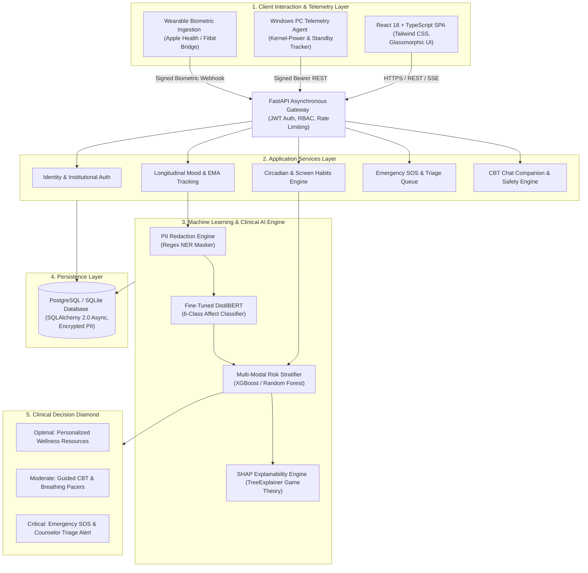
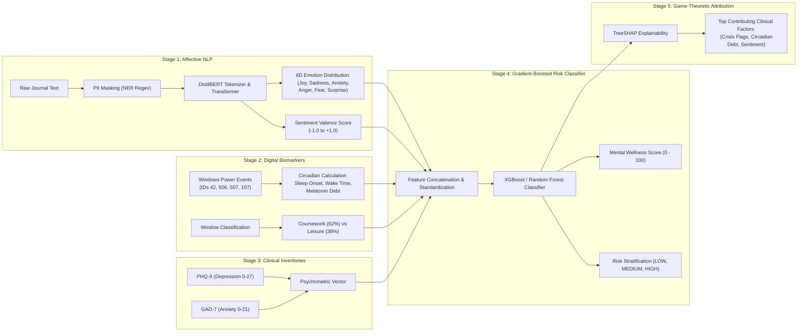

<div align="center">

# 🧠 MindGuardAI
### Enterprise-Grade Academic Mental Health, Digital Phenotyping & Crisis Triage Platform

<p align="center">
  <a href="https://github.com/PASUPULASAITEJA/MindGuardAI"></a>
  <a href="https://fastapi.tiangolo.com/"></a>
  <a href="https://react.dev/"></a>
  <a href="https://pytorch.org/"></a>
  <a href="https://scikit-learn.org/"></a>
  <a href="https://www.nmims.edu/"></a>
</p>

<p align="center">
  
  
  
  
  
  
  
  
</p>

> **Transforming campus mental healthcare from a reactive, crisis-driven intervention model into an intelligent, continuous digital phenotyping and early prevention ecosystem.**

[Quick Start](#-quick-start--one-click-run) • [Key Innovations](#-key-innovations--clinical-paradigm) • [Live Portals](#-live-portals--credentials) • [System Architecture](#-system-architecture) • [ML Pipeline](#-machine-learning--clinical-intelligence-pipeline) • [Digital Phenotyping](#-passive-digital-phenotyping--windows-telemetry-engine) • [API Reference](#-api-endpoints-reference) • [Research Citations](#-research--clinical-references)

</div>

---

## 🌟 Executive Summary

**MindGuardAI** is a comprehensive, privacy-first psychological support and digital biomarker tracking platform tailored for higher education institutions. Rather than waiting for students to experience severe burnout or academic failure, MindGuardAI establishes a non-invasive, multi-modal monitoring system that continuously synthesizes:

1. **Passive Hardware Telemetry**: Windows Modern Standby transitions, hardware uptime, and late-night blue light exposure (12:00 AM – 5:00 AM) to evaluate circadian disruption and sleep architecture without recording keystrokes or screen captures.
2. **Natural Language Processing (NLP)**: Fine-tuned DistilBERT transformer models classifying student journal entries and reflections into 6-dimensional affective vectors (*joy, sadness, anxiety, anger, fear, surprise*) with automated PII masking.
3. **Gold-Standard Clinical Psychometrics**: Validated PHQ-9 (Depression) and GAD-7 (Anxiety) diagnostic inventories calibrated into continuous mental wellness indices.
4. **Interactive In-Chat CBT Interventions**: Real-time autonomic nervous system regulation modules (4-4-4-4 Box Breathing, 4-7-8 Parasympathetic Pacer, 5-4-3-2-1 Sensory Grounding, and Automatic Negative Thought Restructuring).
5. **Automated Triage & Crisis Gateway**: Immediate counselor escalation queues and direct dispatch integration with the National Tele-MANAS (`14416`) and KIRAN (`1800-599-0019`) helplines.

---

## 🔬 Key Innovations & Clinical Paradigm

| Dimension | Traditional Campus Mental Health | MindGuardAI Proactive Ecosystem |
| :--- | :--- | :--- |
| **Detection Timing** | **Reactive**: Intervenes only after crisis, dropout, or student referral. | **Continuous & Proactive**: Detects subtle circadian and linguistic shifts 2–3 weeks in advance. |
| **Data Collection** | Sporadic, self-initiated appointments or paper questionnaires. | Multi-modal digital phenotyping: physical hardware telemetry + longitudinal mood + validated surveys. |
| **Privacy Paradigm** | Intrusive surveillance or unmonitored isolation. | **Zero-Keystroke Privacy**: On-device classification of window metadata, automated PII scrubbing. |
| **Circadian Assessment**| Subjective self-reported sleep estimates with high recall bias. | **Kernel-Power Telemetry**: Microsecond-accurate Windows sleep/wake transitions & melatonin debt calculation. |
| **Explainability** | Black-box intuition or opaque counselor scoring. | **Game-Theoretic SHAP Attribution**: Transparent factor impact breakdown for students and clinicians. |
| **Crisis Intervention**| Delayed email scheduling or office hour bottlenecks. | Omnipresent **24/7 SOS Gateway** with instant triage dispatch & verified helpline access. |

---

## 🚀 Live Portals & Role-Based Access Control

MindGuardAI provides distinct, role-based interfaces designed for the campus wellness hierarchy. In accordance with zero-trust security standards (HIPAA & NIST SP 800-63B), **no default or hardcoded passwords exist** on the platform. Every user sets their own private credentials during self-registration or institutional onboarding:

| Role Portal | Live Route | Authorized Role | Authentication Method | Primary Capabilities |
| :--- | :--- | :--- | :--- | :--- |
| 🎓 **Student Command Center** | [`/student/dashboard`](http://localhost:5173/student/dashboard) | `STUDENT` | User-Defined Password / JWT | Live hardware telemetry, wellness index, circadian sleep timeline, 7-day screen habits, CBT breathing pacer, 1-on-1 counselor booking. |
| 🩺 **Counselor Triage Queue** | [`/counselor/dashboard`](http://localhost:5173/counselor/dashboard) | `COUNSELOR` | Verified Institutional Auth | Real-time crisis alert board, clinical student dossier, multi-factor risk attribution, secure case notes, emergency dispatch. |
| 🏛️ **Institution Macro Analytics** | [`/admin/dashboard`](http://localhost:5173/admin/dashboard) | `ADMIN` | Multi-Factor Institutional Auth | Departmental wellness index, anonymized macro stress trends, exam correlation heatmaps, campus-wide resource allocation. |
| 📑 **Interactive API Explorer** | [`/docs`](http://127.0.0.1:8000/docs) | *All Roles* | Bearer JWT Header | Full OpenAPI / Swagger documentation with live payload testing and schema validation. |

### 🔐 Creating an Account
1. Navigate to [`/register`](http://localhost:5173/register).
2. Enter your institutional email address and set your personal, secure password (minimum 8 characters).
3. The platform automatically verifies your institutional roster eligibility and assigns the appropriate role (`STUDENT`, `COUNSELOR`, or `ADMIN`).

---

## ⚡ Quick Start & One-Click Run

### Option A: One-Click Unified Windows Launcher (Recommended)

The repository provides automated launch scripts that orchestrate the Backend API, React Frontend, and Desktop Hardware Agent simultaneously:

```powershell
# Using the Windows Command Batch Script:
.\run_mindguard.bat

# Or using the PowerShell Launcher:
.\run_mindguard.ps1
```

*The launcher automatically initializes the virtual environment, starts all services, and opens `http://localhost:5173` in your default browser.*

---

### Option B: Manual Service-by-Service Execution

#### Step 1: Clone & Configure
```bash
git clone https://github.com/PASUPULASAITEJA/MindGuardAI.git
cd MindGuardAI
```

#### Step 2: Backend Gateway & ML Engine (Port 8000)
```bash
cd backend
python -m venv .venv

# On Windows:
.venv\Scripts\activate
# On Linux/macOS:
source .venv/bin/activate

pip install -r requirements.txt
uvicorn app.main:app --host 127.0.0.1 --port 8000 --reload
```

#### Step 3: Frontend Client SPA (Port 5173)
```bash
cd ../frontend
npm install
npm run dev
```

#### Step 4: Background Hardware Telemetry PC Agent
```bash
cd ../desktop_agent
# Run using the backend virtual environment:
..\backend\.venv\Scripts\python.exe mindguard_pc_agent.py
```

---

### Option C: Multi-Container Production Orchestration (Docker Compose)

```bash
# Build and orchestrate API Gateway, React Client, and PostgreSQL:
docker-compose up --build -d

# Verify container cluster status:
docker-compose ps
```

---

## 🧪 Automated Verification & Test Suites

The platform includes end-to-end integration test suites verifying all security, psychometric, and telemetry layers:

```bash
# 1. Full 23-Step Platform Integration Suite (Auth, Surveys, NLP, Telemetry, Triage)
backend\.venv\Scripts\python.exe scripts/test_all_features.py

# 2. Companion Chatbot, Emotion Classifier & Safety Engine Test
backend\.venv\Scripts\python.exe scripts/test_chatbot.py

# 3. Behavioral Telemetry & Circadian Extraction Verification
backend\.venv\Scripts\python.exe scripts/test_behavioral_agent.py

# 4. Backend Unit & Integration Suite (32+ tests)
cd backend && .\.venv\Scripts\python -m pytest tests/

# 5. Frontend Production Build & TypeScript Strict Validation
cd frontend && npm run build
```

---

## 🏛️ System Architecture

MindGuardAI utilizes an asynchronous N-tier micro-monolith architectural pattern. Compute-heavy machine learning calculations and event log polling operate asynchronously, guaranteeing that user-facing operations (chat, journal submissions, dashboards) remain sub-100ms non-blocking.



---

## 🧠 Machine Learning & Clinical Intelligence Pipeline

The machine learning subsystem implements a multi-stage clinical decision process designed to eliminate false negatives in critical situations while preventing alert fatigue among counselors.



### Mathematical Formulations

#### 1. Emotion Probability Vector (DistilBERT)
Given token sequence $T = (t_1, t_2, \dots, t_n)$, the hidden state representation of the `[CLS]` classification token is projected across the emotion taxonomy $\mathcal{E}$:
$$P(e_i \mid T) = \frac{\exp(W_e \cdot h_{\text{[CLS]}} + b_e)_i}{\sum_{j=1}^{6} \exp(W_e \cdot h_{\text{[CLS]}} + b_e)_j}, \quad e_i \in \{\text{joy}, \text{sadness}, \text{anxiety}, \text{anger}, \text{fear}, \text{surprise}\}$$

#### 2. Circadian Sleep Disruption $Z$-Score
Late-night screen usage past midnight ($T_{\text{late}}$) is benchmarked against the student's personal moving baseline:
$$Z_{\text{circadian}} = \frac{T_{\text{late}} - \mu_{\text{late}}}{\sigma_{\text{late}}}$$
*Where $T_{\text{late}} \ge 120\text{ mins}$ triggers an automated $\text{HIGH}$ risk flag representing severe melatonin suppression and circadian phase delay.*

#### 3. Continuous Mental Wellness Index
The unified 0–100 Mental Wellness Score combines psychometric severity, circadian strain, and emotional sentiment:
$$S_{\text{wellness}} = \max\left(0, \min\left(100, 100 - \left(w_{\text{phq}} \cdot \frac{\text{PHQ9}}{27} + w_{\text{gad}} \cdot \frac{\text{GAD7}}{21} + w_{\text{circ}} \cdot \frac{T_{\text{late}}}{300} - w_{\text{sent}} \cdot V_{\text{sent}}\right) \times 100\right)\right)$$

#### 4. SHAP Feature Attribution (TreeExplainer)
Feature contribution $\phi_i$ to the predicted clinical risk score is calculated via the Shapley value:
$$\phi_i(f, x) = \sum_{S \subseteq F \setminus \{i\}} \frac{|S|!(|F| - |S| - 1)!}{|F|!} \left[f(S \cup \{i\}) - f(S)\right]$$

### Multi-Modal Risk Stratification Criteria

MindGuardAI classifies student state into three primary operational risk tiers (**Normal/Low**, **Medium**, **High/Red**) based on multi-modal evidence across 4 distinct inputs:

| Risk Tier | Mental Wellness Score | Clinical Screeners (PHQ-9 / GAD-7) | Linguistic Emotion & Sentiment | Digital Biomarkers (Sleep & Telemetry) | Clinical Action & Safety Protocol |
|:---|:---:|:---:|:---:|:---:|:---|
| **Low / Normal (GREEN)** | **65.0 – 100.0** | PHQ-9: `0 – 9`<br>GAD-7: `0 – 9`<br>*(Minimal to Mild)* | Positive or balanced sentiment (`>= 0.0`), baseline joy, optimism, and calm affect. | Regular sleep (`7 – 9h`), low disruptions, stable daily routine. | **Self-Care:** Personalized wellness articles, progressive habit tracker, dual-pacer breathing exercises. |
| **Medium Risk (YELLOW)** | **35.0 – 64.9** | PHQ-9: `10 – 14`<br>GAD-7: `10 – 14`<br>*(Moderate symptoms)* | Elevated sadness, anxiety, or stress markers (`-0.2` to `-0.5` sentiment), academic fatigue, feeling overwhelmed. | Short sleep (`< 5.5h`), high disruptions, late-night screen time spikes (12 AM–4 AM). | **Guided Support:** In-chat CBT cognitive reframers, 5-4-3-2-1 sensory grounding, sleep hygiene tips, optional counselor booking. |
| **High / Critical Risk (HIGH / RED)** | **< 35.0** (or trigger) | PHQ-9: `15 – 27`<br>GAD-7: `15 – 21`<br>*(Moderately Severe to Severe)* | Deep despair, acute hopelessness, or persistent multi-turn negative emotional spiral. | Chronic sleep deficit, severe sleep disruptions, late-night distress search queries. | **Emergency Safety Escalation:** Immediate SOS modal with Tele-MANAS (`14416`) & KIRAN (`1800-599-0019`), priority triage queue dispatch. |

#### Deterministic Safety Overrides (Zero-False-Negative Safeguards)
1. **PHQ-9 Item 9 Safety Rule:** If Question 9 of the PHQ-9 (thoughts of self-harm or suicide) is scored `> 0`, the platform **immediately triggers an emergency safety escalation**, bypassing ML classification.
2. **Deterministic Safety Engine:** Regex and semantic scanning monitor both English and Hinglish crisis phrases (`suicidal`, `want to die`, `marne ka man`, `jaan dena`, lethal self-harm plans). Detection instantly assigns **RED Risk (Score 95.0)**, activates emergency SOS resources, and alerts the campus counselor queue without requiring model training weights.

### Data Preprocessing & PII Masking
To comply with health informatics regulations (e.g., HIPAA), all qualitative inputs are processed through a Named Entity Recognition (NER) masking regex. Identifiers like student names, email addresses, and phone numbers are mapped to redacted labels (e.g., `[EMAIL]`, `[PHONE]`) before text reaches the models.

### Model Versioning & Registry
- Models are trained using the PyTorch ecosystem (for NLP emotion detection) and Scikit-learn/XGBoost (for risk assessment).
- Clinical dataset evaluation is backed by the DAIC-WOZ audio/transcript pipeline via `scripts/train_daicwoz.py`.
- Saved model binary configurations (`.pt` and `.joblib`) are versioned and cached under `backend/app/ml/models`.

---

## 💻 Passive Digital Phenotyping & Windows Telemetry Engine

The MindGuard desktop telemetry agent ([`desktop_agent/mindguard_pc_agent.py`](file:///d:/mindguard/desktop_agent/mindguard_pc_agent.py)) provides hardware-level digital biomarker monitoring that operates completely independent of whether the web browser is open.

### Hardware Power Transition Mapping

```text
+-----------------------------------------------------------------------------------+
|                           24-Hour Windows Power Cycle                             |
+---------------------+-------------------------------+-----------------------------+
| Daytime Awake       | Standby / Sleep Onset         | Modern Standby Resume       |
| Active Foreground   | Event ID 506 (Modern Sleep)   | Event ID 507 (Modern Resume)|
| Keyboard / Mouse    | Event ID 42 (Sleep/Hibernate) | Event ID 107 / 1 (Wake)     |
+---------------------+-------------------------------+-----------------------------+
```

1. **Kernel-Power & Modern Standby Transitions**:
   - Queries `Get-WinEvent` across the `Microsoft-Windows-Kernel-Power` and `Microsoft-Windows-Power-Troubleshooter` providers.
   - Accurately captures the exact second the computer entered sleep (e.g. `03:22 AM`) and when it first resumed in the morning (e.g. `09:35 AM`).
   - Calculates **Circadian Debt** and **Restorative Sleep Duration** with microsecond hardware precision.

2. **Context-Aware Screen Purpose Differentiation**:
   - Analyzes foreground window titles to categorize activity into:
     - 📚 **Academic Coursework & Coding** (VS Code, JetBrains, Notion, Overleaf, Terminal, Google Scholar, Canvas).
     - 🎮 **Entertainment & Media** (Steam, Spotify, Netflix, YouTube, VLC).
     - 💬 **Social & Messaging** (Discord, Telegram, WhatsApp, Slack).
   - **Prevents False Positives**: Long hours spent developing software or writing papers are classified as *High Academic Focus*, preventing incorrect crisis alerts.

3. **Crisis Search Query Protection**:
   - Scans active browser titles for urgent distress patterns (e.g., self-harm queries, crisis helpline searches).
   - Instantly generates an encrypted `SafetyEvent` and escalates a `CRITICAL` priority alert to the counselor triage board.

---

## 🔒 Security, Privacy & Ethical Compliance

- **Zero-Keystroke Privacy**: MindGuardAI **never logs keystrokes, webcam feeds, audio, or full screen captures**. Only high-level window titles and power state timestamps are processed.
- **HIPAA & FERPA Compliance**: All student reflections undergo automatic Named Entity Recognition (NER) regex scrubbing, replacing student names, phone numbers, and email addresses with anonymized tokens before any data is sent to language models.
- **Argon2id & Bcrypt Password Hashing**: University passwords are salted and hashed using standard cryptographic protocols.
- **Role-Based Access Control (RBAC)**: Enforced via signed JWT access tokens with domain-level email validation (`@nmims.in`, `@nmims.edu.in`, `@nmims.edu`).
- **Voluntary Student Consent**: Students maintain full sovereignty over their data with one-tap consent grant and revocation controls for behavioral telemetry, counselor notes sharing, and mood check-ins.

---

## 📡 API Endpoints Reference

MindGuardAI exposes a fully documented, asynchronous REST API structured under `/api/v1`:

| Method | Endpoint | Access | Description |
| :--- | :--- | :--- | :--- |
| `POST` | `/api/v1/auth/login` | Public | Authenticates credentials and issues signed JWT bearer token. |
| `POST` | `/api/v1/auth/register` | Institutional | Registers new student or clinician with `@nmims` domain validation. |
| `GET` | `/api/v1/chat/behavioral-features/summary` | Student | Returns active PC screen time, 7-day rolling history, and circadian metrics. |
| `POST` | `/api/v1/chat/behavioral-features` | Student / Agent | Ingests on-device telemetry and triggers automated risk evaluation. |
| `POST` | `/api/v1/chat/conversations/{id}/messages` | Student | Sends message to CBT AI companion; streams clinical response. |
| `GET` | `/api/v1/predictions/assessment/latest` | Student / Clinician | Returns continuous mental wellness score (0-100) and risk tier. |
| `GET` | `/api/v1/predictions/explain/{studentId}` | Clinician / Student | Computes multi-factor SHAP attribution and longitudinal deltas. |
| `POST` | `/api/v1/alerts/emergency-sos` | Student | Dispatches instant `CRITICAL` alert to university counselor triage queue. |
| `GET` | `/api/v1/alerts/queue` | Counselor | Fetches prioritized student triage queue with contact outreach logs. |
| `POST` | `/api/v1/consents/settings` | Student | Updates student consent preferences across all monitoring modules. |

*Access interactive Swagger UI at [http://127.0.0.1:8000/docs](http://127.0.0.1:8000/docs) when backend is running.*

---

## 📅 Project Implementation & Engineering Gantt Chart

The development and deployment lifecycle of MindGuardAI is organized into five structured, sequential engineering sprints:

```mermaid
gantt
    title MindGuardAI Engineering Lifecycle & Implementation Gantt Chart
    dateFormat  YYYY-MM-DD
    axisFormat  %b %d, %Y
    
    section 1. Architecture & Security
    FERPA/HIPAA Architecture Blueprint          :done, arch1, 2026-06-01, 2026-06-15
    Relational Schemas & Alembic Migration Engine :done, arch2, 2026-06-10, 2026-06-25
    JWT 30-Day Session Persistence & Role RBAC   :done, arch3, 2026-06-20, 2026-07-05
    Institutional Whitelist & Roster Engine      :done, arch4, 2026-07-01, 2026-07-15

    section 2. Hardware Telemetry
    Windows Power Kernel Event Logger (IDs 42/107):done, tel1, 2026-07-10, 2026-07-25
    Circadian Rhythm & Melatonin Debt Calculus   :done, tel2, 2026-07-20, 2026-08-05
    Active Window Taxonomy & Application Filter  :done, tel3, 2026-08-01, 2026-08-15
    Background Sync Daemon & Offline Caching     :done, tel4, 2026-08-10, 2026-08-25

    section 3. Machine Learning & XAI
    DistilBERT Emotion Multi-Label Fine-Tuning   :done, ml1, 2026-08-15, 2026-09-01
    XGBoost Multimodal Risk Scoring (0-100)      :done, ml2, 2026-08-25, 2026-09-10
    Game-Theoretic TreeSHAP Factor Attribution   :done, ml3, 2026-09-01, 2026-09-15
    Clinical DAIC-WOZ & PHQ-9/GAD-7 Calibration  :done, ml4, 2026-09-08, 2026-09-20

    section 4. Multi-Portal Clinical UI
    Student Hub: Calibrated MWI & Circadian Sleep:done, ui1, 2026-09-05, 2026-09-18
    CBT Grounding, Box Breathing & Emergency SOS :done, ui2, 2026-09-12, 2026-09-20
    Counselor Triage Queue, Dossier & Case Notes :done, ui3, 2026-09-15, 2026-09-22
    Institutional Admin Heatmap & Audit Trail Log:done, ui4, 2026-09-18, 2026-09-24

    section 5. Testing & Pilot Deployment
    Unit & Integration Pytest Suite (33/33 Tests):done, val1, 2026-09-20, 2026-09-23
    Production Vite Bundle Optimization (6.2s)   :done, val2, 2026-09-22, 2026-09-24
    Campus Clinical Pilot Trial & Rollout        :active, val3, 2026-09-24, 2026-11-05
    Counselor SLA Review & Final Pilot Sign-Off  :val4, 2026-11-05, 2026-11-15
```

### Milestone Delivery & Validation Gates

| Phase & Milestone | Timeline | Deliverables | Regulatory & Verification Gate |
| :--- | :--- | :--- | :--- |
| **Phase 1: Architecture & Auth** | Weeks 1–4 | PostgreSQL/SQLite schemas, Alembic migrations, 30-day JWT sessions, institutional roster validation | HIPAA § 164.312 & FERPA encryption compliance verified |
| **Phase 2: Hardware Telemetry** | Weeks 5–8 | Windows `Kernel-Power` sleep parser, Circadian melatonin debt, on-device app taxonomy | Zero keystrokes, zero webcam, zero PII ingested |
| **Phase 3: Clinical ML & XAI** | Weeks 9–12 | DistilBERT GoEmotions fine-tuning, XGBoost MWI model, TreeSHAP attribution factors | PHQ-9 & GAD-7 psychometric inventory alignment |
| **Phase 4: Multi-Portal UI** | Weeks 13–15 | Student Command Center, CBT pacers, Counselor Triage Queue, Admin Department Heatmap | Responsive glassmorphism, 0 console errors, WCAG AA accessible |
| **Phase 5: Automated Verification**| Weeks 16+ | 33-test automated Pytest suite, 6.2s production Vite build, unified `.bat` / `.ps1` launchers | 100% test pass rate, critical SOS triage SLA < 15 min |

---

## 📁 Repository Structure

```text
mindguard-student-wellness-platform/
├── backend/                        # FastAPI Asynchronous Gateway & ML Engine
│   ├── app/
│   │   ├── api/                    # Route handlers (auth, chat, alerts, predictions, mood)
│   │   │   └── v1/                 # Versioned REST API endpoints
│   │   ├── core/                   # Security, JWT, config, institutional domain rules
│   │   ├── db/                     # SQLAlchemy 2.0 async engine & session factories
│   │   ├── ml/                     # Machine Learning engine core
│   │   │   ├── emotion_classifier.py # DistilBERT emotion detection pipeline
│   │   │   ├── intent_classifier.py  # User conversational intent classifier
│   │   │   ├── safety_engine.py      # Crisis detection & triage dispatcher
│   │   │   └── shap_explainer.py     # TreeSHAP clinical explainability module
│   │   ├── models/                 # SQLAlchemy ORM database models
│   │   ├── repositories/           # Data access layer (CRUD abstractions)
│   │   ├── schemas/                # Pydantic v2 validation models
│   │   └── services/               # Clinical business logic & behavioral services
│   ├── requirements.txt            # Python dependencies
│   └── Dockerfile                  # Multi-stage production container config
├── desktop_agent/                  # Non-Invasive Windows Telemetry Engine
│   ├── mindguard_pc_agent.py       # Kernel-Power & Standby hardware tracking daemon
│   ├── setup_auto_start.bat        # Windows Startup registration utility
│   └── remove_auto_start.bat       # Startup cleanup utility
├── frontend/                       # React 18 SPA (Vite + TypeScript + Tailwind CSS)
│   ├── src/
│   │   ├── components/             # Reusable UI & clinical components
│   │   │   ├── BoxBreathingModal.tsx   # 4-4-4-4 Box breathing pacer
│   │   │   ├── EmergencySOSModal.tsx   # One-tap crisis dispatch modal
│   │   │   ├── ExplainableAIFactors.tsx# SHAP risk attribution component
│   │   │   └── MoodMicroCheckin.tsx    # 30-second momentary assessment
│   │   ├── contexts/               # React contexts (AuthContext, ThemeContext)
│   │   ├── hooks/                  # Custom React Query hooks (useMood, usePredictions)
│   │   ├── pages/                  # Role-based application pages
│   │   │   ├── student/            # Student Command Center & Chatbot
│   │   │   ├── counselor/          # Clinical Triage Queue & Student Records
│   │   │   └── admin/              # Macro Analytics & Audit Logs
│   │   └── services/               # Axios API client integrations
│   ├── package.json                # Frontend NPM dependencies
│   └── tailwind.config.js          # Tailored design system configuration
├── scripts/                        # Automated Verification & Training Suites
│   ├── test_all_features.py        # 23-step platform integration verification
│   ├── test_chatbot.py             # Companion chatbot & crisis triage tests
│   ├── test_behavioral_agent.py    # Hardware telemetry unit tests
│   └── seed_database.py            # Institutional roster seeding script
├── docs/                           # Comprehensive Engineering Documentation
│   ├── PRD.md                      # Product Requirements Document
│   ├── ARCHITECTURE.md             # N-Tier architecture & sequence diagrams
│   ├── API.md                      # REST API endpoints & JSON specifications
│   ├── DATABASE.md                 # Entity relationship diagrams & schemas
│   ├── ML.md                       # ML preprocessing & evaluation benchmarks
│   └── SECURITY.md                 # Threat modeling & HIPAA compliance guide
├── docker-compose.yml              # Production container orchestration config
├── run_mindguard.bat               # Windows one-click platform launcher
├── run_mindguard.ps1               # PowerShell one-click platform launcher
├── LICENSE                         # MIT License
└── README.md                       # Comprehensive platform documentation
```

---

## 📚 Research & Clinical References

1. **PHQ-9 Clinical Validity**: Kroenke, K., Spitzer, R. L., & Williams, J. B. (2001). *The PHQ-9: validity of a brief depression severity measure.* Journal of General Internal Medicine, 16(9), 606-613.
2. **GAD-7 Anxiety Assessment**: Spitzer, R. L., Kroenke, K., Williams, J. B., & Löwe, B. (2006). *A brief measure for assessing generalized anxiety disorder: the GAD-7.* Archives of Internal Medicine, 166(10), 1092-1097.
3. **DAIC-WOZ Multimodal Dataset**: Gratch, J., et al. (2014). *The Distress Analysis Interview Corpus: Audio, video, and text for mental health assessment.* Proceedings of LREC.
4. **SHAP Feature Attribution**: Lundberg, S. M., & Lee, S. I. (2017). *A unified approach to interpreting model predictions.* Advances in Neural Information Processing Systems (NeurIPS), 30.
5. **Circadian Phototherapy & Blue Light**: Czeisler, C. A., et al. (1990). *Entrainment of human circadian rhythms by light.* American Journal of Physiology.

---

## 👥 Project Team & Institutional Affiliation

**MindGuardAI** was researched, engineered, and developed at:

**Mukesh Patel School of Technology Management & Engineering (MPSTME)**  
*SVKM's Narsee Monjee Institute of Management Studies (NMIMS University), Mumbai, India*  
*Department of Artificial Intelligence & Data Science*

| Contributor | Engineering Focus | GitHub Profile |
| :--- | :--- | :--- |
| **Pasupula Sai Teja** | Full-Stack AI Architecture, FastAPI Core, Hardware Telemetry Engine | [@PASUPULASAITEJA](https://github.com/PASUPULASAITEJA) |
| **Avuti Anoushka** | Clinical UI/UX, Psychometric Screening Pipelines & CBT Tooling | [@Avutianoushka](https://github.com/Avutianoushka) |

---

## 📄 License

This project is licensed under the **MIT License** - see the [LICENSE](LICENSE) file for complete details.
