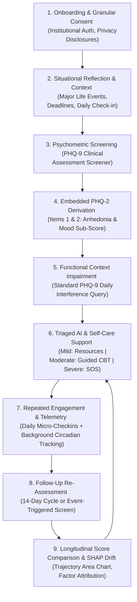
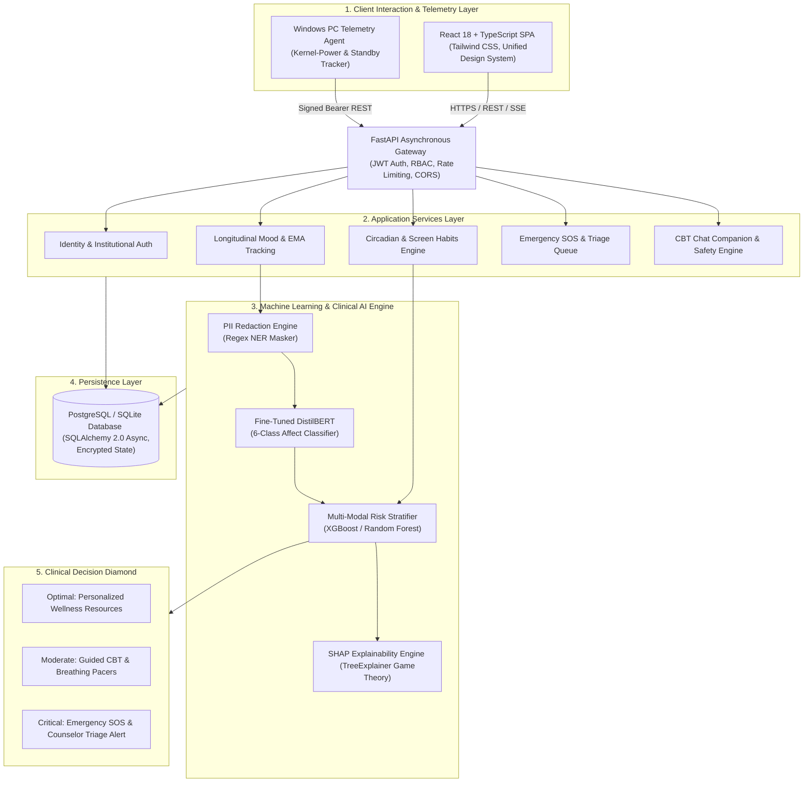
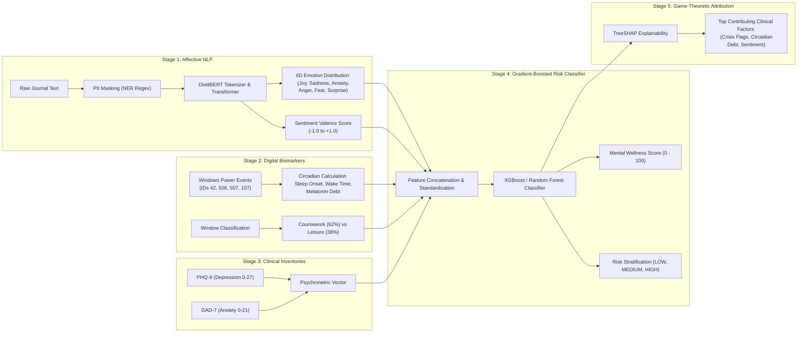

<div align="center">

# 🧠 MindGuardAI
### University-Grade Digital Wellbeing, Behavioral Phenotyping & Early Clinical Support Platform

<p align="center">
  <a href="https://github.com/PASUPULASAITEJA/MindGuardAI"></a>
  <a href="https://fastapi.tiangolo.com/"></a>
  <a href="https://react.dev/"></a>
  <a href="https://pytorch.org/"></a>
  <a href="https://scikit-learn.org/"></a>
  <a href="#"></a>
</p>

<p align="center">
  
  
  
  
  
  
  
  
</p>

> **Transforming campus mental healthcare from a reactive, crisis-driven intervention model into an intelligent, continuous digital phenotyping and early prevention ecosystem.**

[Clinical Workflow](#-end-to-end-clinical--user-workflow) • [Key Innovations](#-key-innovations--clinical-paradigm) • [System Architecture](#-system-architecture) • [ML Pipeline](#-machine-learning--clinical-intelligence-pipeline) • [Digital Phenotyping](#-passive-digital-phenotyping--windows-telemetry-engine) • [Live Portals](#-live-portals--role-based-workflows) • [Quick Start](#-quick-start--one-click-run) • [Research Citations](#-research--clinical-references)

</div>

---

## 🌟 Executive Summary

**MindGuardAI** is an institutional digital wellbeing and psychological support platform engineered specifically for higher education ecosystems. Rather than waiting for students to experience severe burnout, academic withdrawal, or acute crises, MindGuardAI establishes a non-invasive, multi-modal early support architecture that continuously synthesizes:

1. **Passive Hardware Telemetry**: Windows Modern Standby transitions, hardware uptime, and late-night screen activity (12:00 AM – 5:00 AM) to evaluate circadian disruption and sleep architecture without recording keystrokes or screen captures.
2. **Natural Language Processing (NLP)**: Fine-tuned DistilBERT transformer models classifying qualitative reflections into 6-dimensional affective vectors (*joy, sadness, anxiety, anger, fear, surprise*) with automated PII masking.
3. **Gold-Standard Clinical Psychometrics**: Validated PHQ-9 (Depression) and GAD-7 (Anxiety) diagnostic screeners with embedded ultra-brief PHQ-2 derivation.
4. **Interactive In-Chat CBT Interventions**: Real-time autonomic nervous system regulation modules (4-4-4-4 Box Breathing, 5-4-3-2-1 Sensory Grounding, and Automatic Negative Thought Restructuring).
5. **Automated Triage & Crisis Gateway**: Immediate counselor escalation queues and direct dispatch integration with the National Tele-MANAS (`14416`) and KIRAN (`1800-599-0019`) helplines.

---

## 🔄 End-to-End Clinical & User Workflow

MindGuardAI matches a structured, clinically sound continuous care loop designed to identify psychological distress early, provide immediate coping mechanisms, and escalate severe cases with human oversight:



### Clinical Stage Execution

| Stage | Product Component | System Behavior & Clinical Logic |
| :--- | :--- | :--- |
| **1. Onboarding & Consent** | `/register`, [`PrivacyConsentPage.tsx`](file:///frontend/src/pages/student/PrivacyConsentPage.tsx) | Zero-trust registration with student-defined credentials. Transparent disclosures on zero-keystroke telemetry and right to revoke. |
| **2. Situational Reflection** | [`DailyCheckInPage.tsx`](file:///frontend/src/pages/student/DailyCheckInPage.tsx), [`MoodMicroCheckin.tsx`](file:///frontend/src/components/MoodMicroCheckin.tsx) | Student tags situational events (*Exams, Deadlines, Sleep, Relationships*). NLP extracts affective sentiment with PII redaction. |
| **3. PHQ-9 Screener** | [`ClinicalSurveyModal.tsx`](file:///frontend/src/components/ClinicalSurveyModal.tsx) | Guided 9-question DSM-5 depression screener (score 0–27). Deterministic Item 9 safety override for self-harm flags. |
| **4. Derived PHQ-2** | `assessment_service.py` | Automatically extracts Items 1 (*Anhedonia*) and 2 (*Depressed Mood*). A score $\ge 3$ indicates clinical depression threshold. |
| **5. Functional Impairment** | [`ClinicalSurveyModal.tsx`](file:///frontend/src/components/ClinicalSurveyModal.tsx) | Evaluates how difficult symptoms make academic/daily tasks (*Not difficult $\to$ Extremely difficult*). |
| **6. Triaged Care Pathways** | [`StudentChatbot.tsx`](file:///frontend/src/pages/student/StudentChatbot.tsx), [`StudentDashboard.tsx`](file:///frontend/src/pages/student/StudentDashboard.tsx) | Stratifies outcome into: **Self-Care Articles** (0–9), **Guided CBT Tools** (10–14), or **Counsellor Triage Queue & Tele-MANAS** (15+). |
| **7. Repeated Engagement** | [`mindguard_pc_agent.py`](file:///desktop_agent/mindguard_pc_agent.py) | Background circadian telemetry tracks sleep onset, wake time, and active screen habits without user overhead. |
| **8. Follow-up Assessment** | [`MoodHistoryPage.tsx`](file:///frontend/src/pages/student/MoodHistoryPage.tsx) | Re-evaluates validated inventories every 14 days or during significant biometric/sentiment shifts. |
| **9. Longitudinal Comparison** | [`MoodHistoryPage.tsx`](file:///frontend/src/pages/student/MoodHistoryPage.tsx), [`StudentCaseFile.tsx`](file:///frontend/src/pages/counselor/StudentCaseFile.tsx) | 30-day/6-month area chart visualizes trajectory. Clinicians view SHAP factor drift comparing baseline vs. current state. |

---

## 🔬 Key Innovations & Clinical Paradigm

| Dimension | Traditional Campus Mental Health | MindGuardAI Proactive Ecosystem |
| :--- | :--- | :--- |
| **Detection Timing** | **Reactive**: Intervenes only after crisis, academic drop, or self-referral. | **Continuous & Proactive**: Detects subtle circadian and linguistic shifts 2–3 weeks in advance. |
| **Data Collection** | Sporadic, manual appointments or paper questionnaires. | Multi-modal digital phenotyping: physical hardware telemetry + longitudinal mood + validated surveys. |
| **Privacy Paradigm** | Intrusive surveillance or unmonitored isolation. | **Zero-Keystroke Privacy**: On-device classification of window metadata, automated PII scrubbing. |
| **Circadian Assessment**| Subjective self-reported sleep estimates with high recall bias. | **Kernel-Power Telemetry**: Microsecond-accurate Windows sleep/wake transitions & melatonin debt calculation. |
| **Explainability** | Black-box intuition or opaque counselor scoring. | **Game-Theoretic SHAP Attribution**: Transparent factor impact breakdown for students and clinicians. |
| **Crisis Intervention**| Delayed email scheduling or office hour bottlenecks. | Omnipresent **24/7 SOS Gateway** with instant triage dispatch & verified helpline access. |

---

## 🏛️ System Architecture

MindGuardAI is built upon an asynchronous N-tier micro-monolith architectural pattern. Compute-heavy machine learning calculations and event log polling operate asynchronously, guaranteeing sub-100ms response times on user-facing operations:



---

## 🧠 Machine Learning & Clinical Intelligence Pipeline



### Mathematical Formulations

#### 1. Emotion Probability Vector (DistilBERT)
Given token sequence $T = (t_1, t_2, \dots, t_n)$, the hidden state representation of the `[CLS]` classification token is projected across the emotion taxonomy $\mathcal{E}$:
$$P(e_i \mid T) = \frac{\exp(W_e \cdot h_{\text{[CLS]}} + b_e)_i}{\sum_{j=1}^{6} \exp(W_e \cdot h_{\text{[CLS]}} + b_e)_j}, \quad e_i \in \{\text{joy}, \text{sadness}, \text{anxiety}, \text{anger}, \text{fear}, \text{surprise}\}$$

#### 2. Circadian Sleep Disruption $Z$-Score
Late-night screen usage past midnight ($T_{\text{late}}$) is benchmarked against the student's personal moving baseline:
$$Z_{\text{circadian}} = \frac{T_{\text{late}} - \mu_{\text{late}}}{\sigma_{\text{late}}}$$
*Where $T_{\text{late}} \ge 120\text{ mins}$ triggers an automated $\text{HIGH}$ risk flag representing severe melatonin suppression and circadian phase delay.*

#### 3. Continuous Mental Wellness Index
The unified 0–100 Mental Wellness Score combines psychometric severity, circadian strain, and emotional sentiment:
$$S_{\text{wellness}} = \max\left(0, \min\left(100, 100 - \left(w_{\text{phq}} \cdot \frac{\text{PHQ9}}{27} + w_{\text{gad}} \cdot \frac{\text{GAD7}}{21} + w_{\text{circ}} \cdot \frac{T_{\text{late}}}{300} - w_{\text{sent}} \cdot V_{\text{sent}}\right) \times 100\right)\right)$$

#### 4. SHAP Feature Attribution (TreeExplainer)
Feature contribution $\phi_i$ to the predicted clinical risk score is calculated via the Shapley value:
$$\phi_i(f, x) = \sum_{S \subseteq F \setminus \{i\}} \frac{|S|!(|F| - |S| - 1)!}{|F|!} \left[f(S \cup \{i\}) - f(S)\right]$$

### Multi-Modal Risk Stratification Criteria

| Risk Tier | Mental Wellness Score | Clinical Screeners (PHQ-9 / GAD-7) | Linguistic Emotion & Sentiment | Digital Biomarkers (Sleep & Telemetry) | Clinical Action & Safety Protocol |
|:---|:---:|:---:|:---:|:---:|:---|
| **Low / Normal (GREEN)** | **65.0 – 100.0** | PHQ-9: `0 – 9`<br>GAD-7: `0 – 9`<br>*(Minimal to Mild)* | Positive or balanced sentiment (`>= 0.0`), baseline joy, optimism, and calm affect. | Regular sleep (`7 – 9h`), low disruptions, stable daily routine. | **Self-Care:** Personalized wellness articles, progressive habit tracker, dual-pacer breathing exercises. |
| **Medium Risk (YELLOW)** | **35.0 – 64.9** | PHQ-9: `10 – 14`<br>GAD-7: `10 – 14`<br>*(Moderate symptoms)* | Elevated sadness, anxiety, or stress markers (`-0.2` to `-0.5` sentiment), academic fatigue, feeling overwhelmed. | Short sleep (`< 5.5h`), high disruptions, late-night screen time spikes (12 AM–4 AM). | **Guided Support:** In-chat CBT cognitive reframers, 5-4-3-2-1 sensory grounding, sleep hygiene tips, optional counselor booking. |
| **High / Critical Risk (HIGH / RED)** | **< 35.0** (or trigger) | PHQ-9: `15 – 27`<br>GAD-7: `15 – 21`<br>*(Moderately Severe to Severe)* | Deep despair, acute hopelessness, or persistent multi-turn negative emotional spiral. | Chronic sleep deficit, severe sleep disruptions, late-night distress search queries. | **Emergency Safety Escalation:** Immediate SOS modal with Tele-MANAS (`14416`) & KIRAN (`1800-599-0019`), priority triage queue dispatch. |

#### Deterministic Safety Overrides (Zero-False-Negative Safeguards)
1. **PHQ-9 Item 9 Safety Rule:** If Question 9 of the PHQ-9 (thoughts of self-harm or suicide) is scored `> 0`, the platform **immediately triggers an emergency safety escalation**, bypassing ML classification.
2. **Deterministic Safety Engine:** Regex and semantic scanning monitor both English and Hinglish crisis phrases (`suicidal`, `want to die`, `marne ka man`, `jaan dena`, lethal self-harm plans). Detection instantly assigns **RED Risk (Score 95.0)**, activates emergency SOS resources, and alerts the campus counselor queue without requiring model training weights.

---

## 💻 Passive Digital Phenotyping & Windows Telemetry Engine

The MindGuard desktop telemetry agent ([`desktop_agent/mindguard_pc_agent.py`](file:///desktop_agent/mindguard_pc_agent.py)) provides hardware-level digital biomarker monitoring that operates completely independent of whether the web browser is open.

```text
+-----------------------------------------------------------------------------------+
|                           24-Hour Windows Power Cycle                             |
+---------------------+-------------------------------+-----------------------------+
| Daytime Awake       | Standby / Sleep Onset         | Modern Standby Resume       |
| Active Foreground   | Event ID 506 (Modern Sleep)   | Event ID 507 (Modern Resume)|
| Keyboard / Mouse    | Event ID 42 (Sleep/Hibernate) | Event ID 107 / 1 (Wake)     |
+---------------------+-------------------------------+-----------------------------+
```

1. **Kernel-Power & Modern Standby Transitions**: Queries `Get-WinEvent` across the `Microsoft-Windows-Kernel-Power` and `Microsoft-Windows-Power-Troubleshooter` providers to extract precise sleep onset and wake timestamps.
2. **Zero-Keystroke Privacy Architecture**: Strictly analyzes foreground application metadata categories (*Development/Academic* vs *Leisure*) with zero keystroke logging, zero screen captures, and zero camera access.
3. **Smart Break & Rest Reminders**: Notifies students during uninterrupted coding/study sessions exceeding 90 minutes.

---

## 🚀 Live Portals & Role-Based Workflows

In accordance with zero-trust security standards (HIPAA & NIST SP 800-63B), **no default or hardcoded passwords exist** on the platform. Every user sets their own private credentials during self-registration:

| Role Portal | Live Route | Authorized Role | Primary Capabilities |
| :--- | :--- | :--- | :--- |
| 🎓 **Student Command Center** | [`/student/dashboard`](http://localhost:5173/student/dashboard) | `STUDENT` | Longitudinal wellbeing area chart, 5-state sentiment check-in, circadian sleep timeline, 7-day screen habits, CBT breathing pacer, 1-click counselor booking. |
| 🩺 **Counselor Triage Queue** | [`/counselor/dashboard`](http://localhost:5173/counselor/dashboard) | `COUNSELOR` | Priority triage queue table, 5-tab student case workspace, multi-factor risk attribution, secure case notes, emergency dispatch. |
| 🏛️ **Institution Macro Analytics** | [`/admin/dashboard`](http://localhost:5173/admin/dashboard) | `ADMIN` | Departmental wellness index, k-anonymity campus zone heatmaps, institutional resource allocation, audit log streams. |
| 📑 **Interactive API Explorer** | [`/docs`](http://127.0.0.1:8000/docs) | *All Roles* | Full OpenAPI / Swagger documentation with live payload testing and schema validation. |

---

## ⚡ Quick Start & One-Click Run

### Option A: One-Click Unified Windows Launcher (Recommended)

The repository provides automated launch scripts that orchestrate the Backend API, React Frontend, and Desktop Hardware Agent simultaneously:

```powershell
# Using the Windows Command Batch Script:
.\run_mindguard.bat

# Or using the PowerShell Launcher:
.\run_mindguard.ps1
```

*The launcher automatically initializes the virtual environment, starts all services, and opens `http://localhost:5173` in your default browser.*

---

### Option B: Manual Service-by-Service Execution

#### Step 1: Clone & Configure
```bash
git clone https://github.com/PASUPULASAITEJA/MindGuardAI.git
cd MindGuardAI
```

#### Step 2: Backend Gateway & ML Engine (Port 8000)
```bash
cd backend
python -m venv .venv

# On Windows:
.venv\Scripts\activate
# On Linux/macOS:
source .venv/bin/activate

pip install -r requirements.txt
uvicorn app.main:app --host 127.0.0.1 --port 8000 --reload
```

#### Step 3: Frontend Client SPA (Port 5173)
```bash
cd ../frontend
npm install
npm run dev
```

#### Step 4: Background Hardware Telemetry PC Agent
```bash
cd ../desktop_agent
..\backend\.venv\Scripts\python.exe mindguard_pc_agent.py
```

---

### Option C: Multi-Container Production Orchestration (Docker Compose)

```bash
# Build and orchestrate API Gateway, React Client, and PostgreSQL:
docker-compose up --build -d

# Verify container cluster status:
docker-compose ps
```

---

## 🧪 Automated Verification & Test Suites

The platform includes end-to-end integration test suites verifying all security, psychometric, and telemetry layers:

```bash
# 1. Full 23-Step Platform Integration Suite (Auth, Surveys, NLP, Telemetry, Triage)
backend\.venv\Scripts\python.exe scripts/test_all_features.py

# 2. Companion Chatbot, Emotion Classifier & Safety Engine Test
backend\.venv\Scripts\python.exe scripts/test_chatbot.py

# 3. Behavioral Telemetry & Circadian Extraction Verification
backend\.venv\Scripts\python.exe scripts/test_behavioral_agent.py

# 4. Backend Unit & Integration Suite (32+ tests)
cd backend && .\.venv\Scripts\python -m pytest tests/

# 5. Frontend Production Build & TypeScript Strict Validation
cd frontend && npm run build
```

---

## 🔒 Security, Zero-Trust Privacy & Compliance Standards

1. **Zero-Trust User Credentials**: Enforces modern cryptographic password hashing (bcrypt, work factor 12) with student-defined credentials (NIST SP 800-63B).
2. **K-Anonymity Institutional Analytics**: Campus administrators only have access to aggregated cohort wellness metrics ($k \ge 10$) to prevent individual student re-identification.
3. **Automated PII Masking**: Text submitted to the journal or conversational AI is stripped of emails, phone numbers, and identity strings via regex Named Entity Recognition (NER) prior to tensor ingestion.
4. **Append-Only Tamper-Evident Audit Logging**: All sensitive clinician and triage actions generate cryptographic audit records verifying data access integrity.

---

## 📚 Research & Clinical References

- **PHQ-9**: Kroenke, K., Spitzer, R. L., & Williams, J. B. (2001). *The PHQ-9: validity of a brief depression severity measure*. Journal of General Internal Medicine, 16(9), 606-613.
- **PHQ-2**: Kroenke, K., Spitzer, R. L., & Williams, J. B. (2003). *The Patient Health Questionnaire-2: validity of a two-item depression screener*. Medical Care, 41(11), 1284-1292.
- **GAD-7**: Spitzer, R. L., Kroenke, K., Williams, J. B., & Löwe, B. (2006). *A brief measure for assessing generalized anxiety disorder: the GAD-7*. Archives of Internal Medicine, 166(10), 1092-1097.
- **Digital Phenotyping**: Torous, J., Onnela, J. P., & Keshavan, M. (2017). *New markers and modern tools to meet pressing challenges in psychiatry*. Dialogues in Clinical Neuroscience, 19(2), 81-89.
- **Explainable AI (SHAP)**: Lundberg, S. M., & Lee, S. I. (2017). *A unified approach to interpreting model predictions*. Advances in Neural Information Processing Systems (NeurIPS), 30, 4765-4774.

---

<div align="center">
  <sub>MindGuardAI • Designed for Higher Education Wellbeing & Proactive Clinical Support</sub>
</div>
